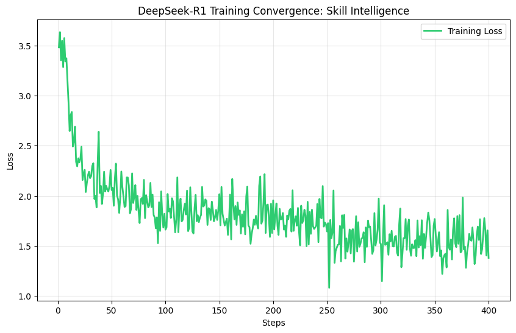

# Skill Intelligence Architect (SIA)

Context-Aware Complexity Estimation via R1-Reasoning Distillation

📌 **Executive Summary**

The **Skill Intelligence Architect (SIA)** is an LLM-based system designed to solve the "Keyword Matching Fallacy" in talent intelligence. Traditional systems treat a skill (e.g., Python) as a binary attribute; SIA quantifies the complexity of that skill (Scale 1-5) by analyzing the surrounding context of a Job Description (JD).

By Distilling reasoning from high-parameter "Teacher" models into a specialized "Student" model (DeepSeek-R1-Distill-Llama-8B), SIA provides high-fidelity, explainable difficulty scores with low latency and inference cost.

🏗️ **Technical Architecture & Stack**

- **Base Model:** Llama-3-8B (vLLM Optimized)

- **Fine-tuning Method:** Parameter-Efficient Fine-Tuning (PEFT) using LoRA.

- **Quantization:** 4-bit NormalFloat (NF4) via bitsandbytes for efficient deployment.

- **Orchestration:** Fine-tuned on Amazon SageMaker; Deployed via Gradio on Hugging Face Spaces.

- **Distillation Logic:** Teacher-Student chain-of-thought (CoT) distillation.
  

🧪 **Methodology & Workflow**

**Phase 1: Knowledge Distillation (The Teacher)**

To bypass the lack of granularly labeled JD datasets, we utilized Anthropic (Claude 3.5 Sonnet) to generate a high-quality "Ground Truth" synthetic dataset.

- **Rubric-Augmented Prompting:** The Teacher model was provided with a strict 5-level rubric.

- **Reasoning Extraction:** Instead of simple labels, we captured the Chain-of-Thought (CoT), explaining why a responsibility aligns with a specific rubric level.

**Phase 2: Supervised Fine-Tuning (The Student)**

We fine-tuned the DeepSeek-R1-Distill-Llama-8B on 100000+ high-fidelity samples.

- **Objective:** The Student was trained to predict the Reasoning Block + Difficulty Score.

- **Outcome:** By learning the logic behind the score, the model generalizes significantly better to unseen industries and emerging tech roles compared to standard classifiers.

**Phase 3: Zero-Data Leakage Pipeline (Self-Distillation)**

To ensure the final deployed weights contain zero direct company data, we implemented a "Clean Room" retraining process:

- **Synthetic Expansion:** The intermediate model (Our student Model) was used to generate 2500+ new, entirely synthetic samples based on refined technical prompts.

- **Final Student Model:** The Gradio-hosted model was retrained only on this second generation of synthetic data.

- **Result:** This ensures that the public-facing weights are derived purely from model-generated reasoning, providing an extra layer of privacy and architectural decoupling.

📑 **Case Study: Contextual Intelligence in Action**

The model's strength lies in its ability to differentiate the same skill across different seniority tiers.

The core differentiator of the SIA model is its ability to interpret the **depth of application** rather than just identifying the presence of a keyword. Below is a side-by-side comparison of the same skill evaluated in two distinct professional environments.

| Skill | Job Title | Responsibility Snippet | Predicted Level |
| :--- | :--- | :--- | :---: |
| **Python** | Junior Data Analyst | "Automating daily Excel reports and basic CSV cleaning." | **Level 2** |
| **Python** | ML Infrastructure Lead | "Designing custom CUDA kernels and optimizing distributed training for 70B+ models." | **Level 5** |

### 🧠 Model Reasoning Breakdown
The model differentiates these cases by analyzing the linguistic relationship between the title and the technical stakes:

* **Case A (Operational):** The model identifies the task as routine data manipulation. It notes that the scope is limited to established library patterns (Pandas/CSV) within a single-system environment, requiring proficiency but minimal architectural ambiguity.
* **Case B (Expert):** The model elevates the score to Level 5 because the task involves "Hardware-Software Co-design" and "High-Stakes Scalability." It recognizes that building custom kernels moves beyond *using* a language into *redefining* foundational technical infrastructure.

📏 **Grading Rubric Framework**

The model operates on a standardized complexity scale to ensure objective evaluation across diverse job families.

| Level | Classification | Professional Description |
| :--- | :--- | :--- |
| **1** | **Foundational** | Basic awareness; follows standard operating procedures (SOPs) and requires high supervision. |
| **2** | **Operational** | Practical application in routine, well-defined tasks within a single-system environment. |
| **3** | **Advanced** | Handles non-routine complexity and specific problem-solving with independent ownership. |
| **4** | **Strategic** | Leads cross-functional initiatives and manages high-stakes ambiguity at a team or department level. |
| **5** | **Expert** | Industry-leading expertise; defines foundational technical paradigms and organizational strategy. |

🔒 Security & Corporate Compliance

**Important Note:** The model weights (LoRA adapters) are hosted in a private Hugging Face repository. This is a deliberate architectural choice to:

1) Comply with the use of corporate compute resources used during the training phase.

2) Protect the proprietary "Teacher" distillation logic and dataset architecture.

3) The public demo utilizes a secure HF_TOKEN handshake to perform inference without exposing the underlying weights.

🚀 **Future Roadmap**

- **Multi-Modal Evaluation:** Integrating CV/Resume parsing to match candidate proficiency against JD complexity.

- **Market Benchmarking:** Correlating difficulty scores with global salary benchmarks for talent acquisition strategy.


## 🚀 Training Results

The distillation process was executed via `scripts/TrainingCode.py`. 

The resulting convergence shows a stable learning rate and successful logic transfer.


[View Training Script](./scripts/TrainingCode.py) | [View Loss Curve](./docs/TrainingLoss_pic.png)<p align="center">

  </p>


```mermaid
graph TD
    A[Anthropic claude-sonnet-4-6] -->|Stage 1: Seed Generation| B(Seed Training Data)
    B -->|Stage 2: Distillation| C{DeepSeek-R1-8B + LoRA}
    C -->|Stage 3: Verified Auditing| D(Intermediate Auditor Model)
    
    E[Anthropic claude-sonnet-4-6] -->|Context Generation| F(Synthetic Responsibilities)
    F --> D
    D -->|Complexity Labeling| G(Clean-Room Synthetic Dataset)
    
    G -->|Stage 4: Final Fine-Tuning| H[Final Skill Intelligence Model]
    H -->|Stage 5: Deployment| I[Live Inference & Gradio UI]

    style A fill:#f9f,stroke:#333,stroke-width:2px
    style H fill:#00ff00,stroke:#333,stroke-width:4px
    style D fill:#bbf,stroke:#333,stroke-width:2px```


